<div align="center">

# 👋 Olá! Eu sou Nelson Benedito

### 💻 Front-End Developer • 🎓 Tecnólogo em Sistemas para Internet

**Transformando ideias em interfaces, experiências e soluções digitais.**

<br>

<a href="https://github.com/NelsonBenedito">
  
</a>
<a href="mailto:nelsonbenejm@gmail.com">
  
</a>

</div>

---

## 👨‍💻 Sobre mim

Sou **Tecnólogo em Sistemas para Internet**, formado em 2026, com foco em **desenvolvimento Front-End**.

Minha trajetória combina **tecnologia, desenvolvimento web e criatividade**. Gosto de transformar ideias em produtos digitais funcionais, intuitivos e visualmente bem construídos.

Também tenho experiência com **design gráfico, edição de vídeo e criação de conteúdo digital**, o que me permite enxergar um projeto tanto pelo lado técnico quanto pelo lado visual.

```text
💻 Desenvolvimento Web
🎨 Design & Experiência Visual
🧠 Resolução de Problemas
🚀 Produtos Digitais
📚 Aprendizado Contínuo
```

---

## 🛠️ Tecnologias & Ferramentas

### 💻 Desenvolvimento

<p>
  
</p>

### 🎨 Design & Criatividade

<p>
  
</p>

**Também trabalho com:** Photoshop • Illustrator • Premiere Pro • Canva • CapCut

---

## 🚀 Atualmente

- 🔭 Desenvolvendo projetos próprios e soluções para problemas reais.
- 📦 Trabalhando no **CargaFácil**, sistema web para controle e conferência de cargas.
- 🌱 Aprofundando conhecimentos em **Next.js, TypeScript, React, Node.js, PostgreSQL e Prisma**.
- 💡 Explorando a combinação de **tecnologia + design + automação**.

---

# 📦 Projeto em destaque — CargaFácil

> Sistema web para controle e conferência de carregamentos.

O **CargaFácil** nasceu da necessidade de transformar um processo operacional de conferência de cargas em um fluxo mais organizado e automatizado.

### 🔄 Fluxo

```text
👤 Gerenciamento
       ↓
📦 Carregamento
       ↓
🚚 Rota
       ↓
🧾 Vendas
       ↓
↩️ Retornos
       ↓
🔄 Trocas
       ↓
📊 Conferência
```

### ⚙️ Stack

`Next.js` `TypeScript` `PostgreSQL` `Prisma` `Tailwind CSS`

### 🎯 Objetivos

- Controle de carregamentos
- Conferência de produtos
- Registro de vendas
- Controle de retornos
- Gerenciamento de trocas
- Conversão de caixas/fardos para unidades
- Dashboard operacional
- Redução de erros na conferência

> 🚧 Projeto em desenvolvimento.

---

# 💼 Experiência

### 🏢 Rede Gazeta

**Estágio em Tecnologia** · `2024 — 2025`

Durante o estágio, tive contato com diferentes etapas do desenvolvimento e manutenção de soluções de software, incluindo:

- Desenvolvimento de aplicações web
- Desenvolvimento de software sob demanda
- Modelagem de software
- Reengenharia de software
- Higienização e preparação de dados para aplicações de IA
- Metodologias ágeis
- Scrum
- Trabalho colaborativo em equipe
- Análise e resolução de problemas

---

# 🎨 Além do código

A tecnologia não é minha única área de interesse.

Tenho experiência com **design gráfico, edição de vídeo e produção de conteúdo digital**.

### 🎨 Design
Photoshop • Illustrator • Figma • Canva

### 🎬 Vídeo
Premiere Pro • CapCut

### 📱 Conteúdo
Social Media • Identidade Visual • Peças Digitais • Edição de Vídeos

> **Código + Design + Criatividade** me permitem participar de um projeto desde a ideia até a implementação.

---

# 📊 GitHub

<div align="center">





</div>

<br>

<div align="center">

### 🐍 Minha atividade no GitHub

<picture>
  <source media="(prefers-color-scheme: dark)" srcset="./profile/github-snake-dark.svg">
  <source media="(prefers-color-scheme: light)" srcset="./profile/github-snake.svg">
  
</picture>

</div>

---

# 🎓 Formação

**Tecnologia em Sistemas para Internet**

🎓 Concluído em **26 de agosto de 2026**

---

# 🎯 O que estou buscando

Quero continuar evoluindo como desenvolvedor e participar da construção de **produtos digitais reais**.

Tenho interesse especial em:

```text
🌐 Aplicações Web
⚡ Performance
🎨 UI / UX
📱 Responsividade
🧩 Arquitetura de Software
🗄️ Banco de Dados
🤖 Automação
💡 Solução de problemas reais
```

---

# 📫 Vamos conversar?

<div align="center">

Se você chegou até aqui, provavelmente temos algum interesse em comum.

**Tecnologia • Desenvolvimento • Design • Projetos • Ideias**

<br>

<a href="https://github.com/NelsonBenedito">
  
</a>

<!-- Substitua os links abaixo pelos seus perfis -->
<a href="SEU_LINKEDIN_AQUI">
  
</a>

</div>

---

<div align="center">

### ⚡ Código é uma ferramenta. Criatividade é o que transforma a ferramenta em solução.

⭐ Obrigado por visitar meu perfil!

</div>
